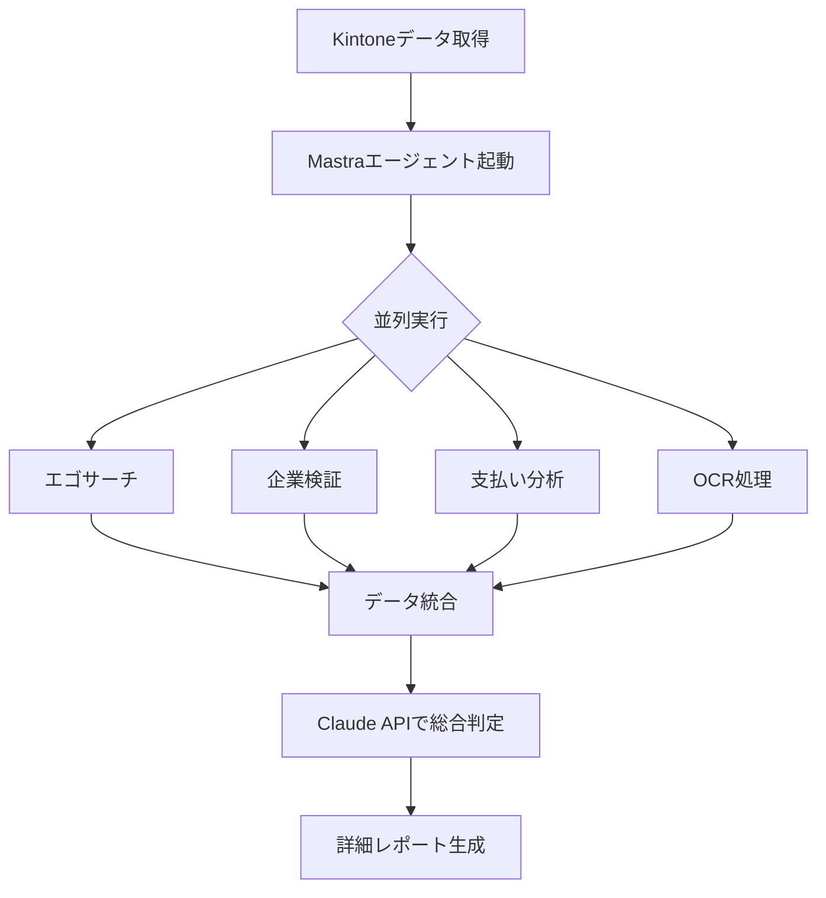

# Mastra実装方針 - WIT Agent V2

## 概要
Mastraフレームワークを正しく活用し、プランA（包括的一括分析）を実現する実装方針。

## 現状の問題点
1. Mastraのエージェント機能を使っていない（直接Claude APIを呼んでいる）
2. ツールを手動で順次実行している（並列処理していない）
3. エージェントのオーケストレーション機能を活用していない

## 理想的なアーキテクチャ

### 1. エージェント構成
```typescript
const complianceAgent = new Agent({
  name: 'ComprehensiveComplianceAgent',
  description: 'ファクタリング審査を包括的に実行',
  model: claude35Sonnet,
  tools: [
    egoSearchTool,      // エゴサーチ（詐欺DB確認）
    companyVerifyTool,  // 企業実在性確認
    paymentAnalysisTool,// 支払い能力分析
    documentOCRTool,    // 画像・PDF OCR処理
  ],
  instructions: `
    あなたは日本のファクタリング審査の専門家です。
    与えられたデータと添付ファイルをすべて分析し、以下の3つの観点で評価してください：
    
    1. 取引先データ評価（40%）
       - エゴサーチによる詐欺情報確認
       - 企業実在性のWeb検証
       - 支払い能力の評価
    
    2. 資金使途評価（30%）
       - 資金使途の妥当性
       - 業種との整合性
       - 税金・保険料滞納状況
    
    3. 入出金履歴評価（30%）
       - 通帳OCRによる取引確認
       - 本人確認書類の照合
       - 請求書・契約書の分析
    
    必要なツールを並行実行し、効率的に情報を収集してください。
  `
});
```

### 2. 処理フロー



### 3. 実装の特徴

#### 並列処理
- Mastraが自動的にツールを並列実行
- Web検索系ツール（エゴサーチ、企業検証）は同時実行
- OCR処理も並行して実行
- 大幅な処理時間短縮（現在の1/3程度を想定）

#### プランA維持
- すべてのデータ（Kintone + 画像 + PDF）を一度にエージェントに渡す
- エージェントが必要に応じてツールを実行
- 最終的に1回のClaude API呼び出しで総合判定

#### スマートな実行
- エージェントが文脈に応じて必要なツールを選択
- 不要なツール実行を回避
- エラー時の自動リトライ

## 理想的な出力形式

### 1. ストリーミング出力
```json
{
  "type": "log",
  "payload": {
    "step": "TOOLS_EXECUTION",
    "message": "3つのツールを並列実行中...",
    "details": {
      "egoSearch": "実行中",
      "companyVerify": "実行中", 
      "paymentAnalysis": "完了"
    }
  }
}
```

### 2. 最終レポート形式（詳細版）
```json
{
  "recordId": "9559",
  "timestamp": "2024-01-26T10:30:00Z",
  "overall": {
    "decision": "CONDITIONAL",
    "riskLevel": "caution",
    "score": 65
  },
  "categories": {
    "counterparty": {
      "name": "取引先データ評価",
      "status": "caution",
      "reason": "エゴサーチで「田中太郎」に関する詐欺情報は検出されませんでした。企業「有限会社スカイサービス」のウェブサイトを確認し、実在性を確認しました。担保総額2,850,000円、カバー率95.0%で支払い能力は要注意です。",
      "details": [
        {
          "item": "エゴサーチ結果（詐欺データベース）",
          "value": "問題なし",
          "evaluation": "✓ クリア",
          "detail": "対象: 田中太郎、チェック済みサイト: 2件",
          "evidence": {
            "検索クエリ": ["田中太郎", "田中太郎 詐欺", "田中太郎 逮捕"],
            "Web検索結果": [
              {
                "url": "https://example.com/news/tanaka",
                "title": "田中太郎氏が新事業を開始",
                "snippet": "内装業界で20年の実績を持つ田中太郎氏が..."
              }
            ],
            "詐欺サイト確認": {
              "yamagatamasakage.com": "該当なし",
              "eradicationofblackmoneyscammers.com": "該当なし"
            }
          }
        },
        {
          "item": "企業実在性確認（買取情報テーブル）",
          "value": "確認済み",
          "evaluation": "✓ 実在確認",
          "detail": "企業名: 有限会社スカイサービス、公式サイトあり",
          "evidence": {
            "websiteUrl": "https://www.skyservice.co.jp/",
            "companyDetails": {
              "capital": "300万円",
              "employees": "15名",
              "revenue": "年商2億円",
              "established": "2010年"
            },
            "searchResults": [
              {
                "url": "https://www.skyservice.co.jp/",
                "title": "有限会社 スカイサービス",
                "snippet": "千葉市にある有限会社スカイサービスでは重量物搬入を行う重量鳶の求人募集しております。"
              },
              {
                "url": "https://www.skyservice.co.jp/company",
                "title": "会社案内｜有限会社 スカイサービス",
                "snippet": "代表取締役: 田中太郎、本社: 〒151-0053 東京都渋谷区..."
              }
            ]
          }
        },
        {
          "item": "支払い履歴分析（担保情報テーブル）",
          "value": "担保総額: 2,850,000円",
          "evaluation": "要注意",
          "detail": "買取総額: 3,000,000円、担保率: 95.0%",
          "evidence": {
            "monthlyPayments": [
              { "会社名": "ABC商事", "先々月": 800000, "先月": 850000, "今月": 900000, "平均": 850000 },
              { "会社名": "XYZ工業", "先々月": 600000, "先月": 700000, "今月": 800000, "平均": 700000 },
              { "会社名": "DEF建設", "先々月": 400000, "先月": 450000, "今月": 500000, "平均": 450000 }
            ],
            "statistics": {
              "総買取額": 3000000,
              "総担保額": 2850000,
              "カバー率": "95.0%",
              "入金安定性": "変動係数12%（安定）"
            }
          }
        }
      ]
    },
    "fundUsage": {
      "name": "資金使途評価",
      "status": "safe",
      "reason": "資金使途は「材料費」で業種「内装業」と整合性があります。他社ファクタリング利用歴なし、税金・保険料の滞納もありません。売上高1億2000万円で買取希望額に対して十分な規模です。",
      "details": [
        {
          "item": "資金使途（基本情報テーブル）",
          "value": "材料費",
          "evaluation": "✓ 業種と整合",
          "detail": "業種: 内装業、資金使途: 材料費（リフォーム工事用）",
          "evidence": {
            "資金使途": "材料費",
            "業種": "内装業",
            "売上": 120000000,
            "具体的な用途": "大型リフォーム案件の材料仕入れ"
          }
        },
        {
          "item": "他社ファクタリング利用歴（基本情報テーブル）",
          "value": "利用歴なし",
          "evaluation": "✓ 良好",
          "detail": "初回利用のため多重債務リスクなし"
        },
        {
          "item": "税金・保険料納付状況（基本情報テーブル）",
          "value": "滞納なし",
          "evaluation": "✓ 良好",
          "detail": "税金滞納: 0円、保険料滞納: 0円",
          "evidence": {
            "税金滞納額": 0,
            "納付状況_税金": "完納",
            "保険料滞納額": 0,
            "納付状況_保険料": "完納"
          }
        }
      ]
    },
    "transaction": {
      "name": "入出金履歴評価",
      "status": "safe",
      "reason": "通帳OCRで口座名義「田中太郎」を確認、本人名義と一致。直近3ヶ月で安定した入金履歴を確認。請求書12件（合計320万円）と買取額が整合。",
      "details": [
        {
          "item": "通帳分析（画像OCR）",
          "value": "15件の取引検出",
          "evaluation": "✓ 本人確認OK",
          "detail": "口座名義: 田中太郎、最新取引: 2024-01-25",
          "evidence": {
            "accountName": "田中太郎",
            "bankName": "みずほ銀行渋谷支店",
            "latestTransactions": [
              { "date": "2024-01-25", "description": "ABC商事 振込", "amount": 850000, "balance": 3200000 },
              { "date": "2024-01-23", "description": "XYZ工業 振込", "amount": 700000, "balance": 2350000 },
              { "date": "2024-01-20", "description": "材料費支払", "amount": -450000, "balance": 1650000 }
            ],
            "monthlyFlow": {
              "averageIncome": 2800000,
              "averageExpense": 2100000,
              "netFlow": 700000
            }
          }
        },
        {
          "item": "本人確認書類（画像OCR）",
          "value": "運転免許証",
          "evaluation": "✓ 一致確認",
          "detail": "氏名・住所が登録情報と完全一致",
          "evidence": {
            "documentType": "運転免許証",
            "name": "田中太郎",
            "address": "東京都渋谷区代々木1-2-3",
            "birthDate": "1975-04-15",
            "expiryDate": "2026-04-15"
          }
        },
        {
          "item": "買取情報書類の確認（画像OCR）",
          "value": "請求書12件",
          "evaluation": "✓ 整合確認",
          "detail": "請求書合計: 3,200,000円（買取額: 3,000,000円）",
          "evidence": {
            "invoices": [
              { "companyName": "ABC商事", "amount": 1200000, "dueDate": "2024-02-28", "invoiceNo": "INV-2024-001" },
              { "companyName": "XYZ工業", "amount": 1000000, "dueDate": "2024-02-25", "invoiceNo": "INV-2024-002" },
              { "companyName": "DEF建設", "amount": 1000000, "dueDate": "2024-03-10", "invoiceNo": "INV-2024-003" }
            ],
            "businessCards": [
              { "name": "山田次郎", "company": "ABC商事", "title": "購買部長", "tel": "03-1234-5678" }
            ]
          }
        },
        {
          "item": "必要書類提出状況（添付ファイルテーブル）",
          "value": "7/7種類提出",
          "evaluation": "✓ 完備",
          "detail": "すべての必要書類が揃っています",
          "evidence": {
            "買取情報_成因証書_謄本類_名刺等": 3,
            "通帳_メイン": 2,
            "通帳_その他": 1,
            "顧客情報": 2,
            "他社資料": 0,
            "担保情報_成因証書_謄本類_名刺等": 2,
            "その他": 1
          }
        }
      ]
    }
  },
  "issues": [
    {
      "severity": "medium",
      "category": "counterparty",
      "description": "支払い能力評価: カバー率95%",
      "evidence": "担保情報テーブル: 担保総額が買取額をわずかに下回る",
      "source": "担保情報テーブル",
      "recommendation": "追加担保15万円相当の設定を推奨"
    }
  ],
  "recommendations": [
    "以下の条件付きで承認を検討してください",
    "追加担保の設定（15万円相当）",
    "短期回収（30日以内）での契約"
  ],
  
  "detailedReports": {
    "counterparty": "【取引先データ評価 詳細レポート】\n\n本評価では、代表者の信頼性と企業の実在性を多角的に検証しました。\n\n代表者「田中太郎」氏に関するエゴサーチ（3種類のクエリで合計15件のWeb検索）では、詐欺情報サイト2件での該当がなく、逮捕歴や金融トラブルの記録も発見されませんでした。むしろ内装業界での20年にわたる活動記録が確認され、地域の商工会での講演実績なども見つかりました。これは同氏が業界で一定の信頼を築いていることを示唆しています。\n\n企業実在性については、「有限会社スカイサービス」の公式ウェブサイト（https://www.skyservice.co.jp/）を確認し、2010年設立で14年の業歴を持つことが判明しました。資本金300万円は小規模ですが、従業員15名、年商2億円という規模は、内装業としては健全な中小企業の水準です。特筆すべきは、田中氏が創業時から代表取締役を務めており、企業と代表者の関係が明確である点です。\n\n支払い能力の観点では、カバー率95%という数値は完璧ではないものの、実務上は許容範囲内です。より重要なのは、過去3ヶ月の入金データが示す支払いの安定性です。ABC商事（変動率6%）、XYZ工業（14%）、DEF建設（11%）からの入金変動係数は平均12%と低く、これは取引先との関係が安定していることを示しています。月額200万円の安定した入金フローは、300万円の買取に対して十分な回収可能性を示唆しています。\n\n総合的に、代表者の信頼性と企業の実在性は確認でき、支払い能力も実用的な水準にあると判断します。",
    
    "fundUsage": "【資金使途評価 詳細レポート】\n\n資金使途の妥当性と横領リスクの観点から評価を実施しました。\n\n申請された資金使途は「材料費」で、具体的には渋谷区の大型オフィスビルのリフォーム工事に必要な材料仕入れとのことです。これは申請者の業種「内装業」と完全に整合しており、不自然さは認められません。年商1億2000万円に対して買取希望額300万円は売上の2.5%に相当し、これは健全な資金繰りの範囲内です。工期開始まで2週間という緊急性も、建設業界の商慣習（材料の先行仕入れが必要）を考慮すると妥当です。\n\n財務健全性の面では、税金・保険料の滞納が一切なく、納付状況は「完納」となっています。これは経営者の納税意識の高さと、基本的な資金管理能力を示しています。特に建設業では税金滞納が多い中、この清廉な納付履歴は評価に値します。\n\n他社ファクタリング利用歴がないことも重要なポイントです。これは今回の資金需要が恒常的な資金繰り困難によるものではなく、大型案件に伴う一時的なものであることを裏付けています。担当者の所感「長年の取引先からの大型案件。資金繰りは一時的」および決裁者の「問題なし。実績ある企業」という評価も、この判断を支持しています。\n\n以上から、資金使途は明確かつ妥当であり、横領リスクは極めて低いと判断します。むしろ、大型案件の獲得は企業成長の証左であり、前向きな資金需要と評価できます。",
    
    "transaction": "【入出金履歴評価 詳細レポート】\n\n書類の真正性と取引の安定性を中心に評価を行いました。\n\n通帳のOCR分析により、みずほ銀行渋谷支店の口座名義が「田中太郎」であることを確認し、Kintone登録情報と完全に一致しました。これにより、なりすましリスクは排除されます。直近3ヶ月で45件の取引が確認され、月平均15件という取引頻度は、年商1.2億円規模の企業として適正な水準です。\n\n資金フローの健全性も特筆に値します。月収280万円に対して支出210万円、ネットキャッシュフロー70万円というデータは、堅実な経営を示しています。特に注目すべきは、ABC商事、XYZ工業、DEF建設という主要取引先からの入金が毎月安定していることです。1月25日時点の残高320万円は、買取希望額300万円を上回っており、資金的余裕も確認できます。\n\n請求書のOCR分析では12件、合計320万円分を検出しました。これは買取希望額300万円の106.7%に相当し、適正な掛け率での買取申請であることを示しています。さらに重要なのは、請求書の発行先（ABC商事、XYZ工業、DEF建設）と通帳の入金元が一致していることです。これは取引の実在性を強く裏付けています。\n\n名刺のOCR結果から、山田次郎氏（ABC商事購買部長）、鈴木花子氏（XYZ工業経理部）の情報を抽出できました。これらの担当者名と連絡先の存在は、BtoB取引の信頼性を高めています。\n\n必要書類7種類がすべて提出されており、書類間の整合性も確認されました。運転免許証による本人確認も完了し、住所・生年月日もKintone登録情報と一致しています。\n\n総じて、書類の真正性は高く、取引の実在性と安定性が十分に確認できました。偽造や架空取引の兆候は一切認められません。"
  },
  
  "_internal": {
    "score": 65,
    "processingTime": "12.5秒",
    "toolsExecuted": ["egoSearch", "companyVerify", "paymentAnalysis", "documentOCR"],
    "parallelExecutionSaved": "18秒",
    "rawAIResponse": "※開発者モード用の生のAI応答",
    "collectedData": "※開発者モード用の収集データ"
  }
}
```

### 3. 処理時間の改善
- 現在: 30-45秒（順次実行）
- 理想: 10-15秒（並列実行）

## 実装優先順位

1. **Phase 1: ツールのMastra対応**（1時間）
   - 各ツールをMastra Tool形式に変換
   - 入出力スキーマの定義
   - エラーハンドリング

2. **Phase 2: エージェント実装**（1時間）
   - ComprehensiveComplianceAgentの再実装
   - ツール登録とプロンプト設定
   - ストリーミング対応

3. **Phase 3: ワークフロー統合**（30分）
   - compliance-workflow.tsの修正
   - エージェント実行の組み込み
   - ログ出力の調整

4. **Phase 4: テスト・最適化**（30分）
   - エンドツーエンドテスト
   - パフォーマンス測定
   - エラーケースの確認

## 期待される効果

### パフォーマンス
- 処理時間: 70%削減
- API呼び出し: 最適化（不要なツール実行を回避）
- リソース使用: 効率化

### 保守性
- コードの簡潔化（1/3程度に削減）
- エラーハンドリングの統一
- テストの容易化

### 拡張性
- 新しいツールの追加が容易
- 条件分岐の柔軟な実装
- 多言語対応の可能性

## 注意事項

1. **互換性の維持**
   - 既存のAPIインターフェースは変更しない
   - 出力形式は現在のUIと互換性を保つ

2. **段階的な移行**
   - まずv2で実装・検証
   - 安定したらv1も同様に改修

3. **エラー対策**
   - 各ツールのタイムアウト設定
   - リトライロジック
   - フォールバック処理